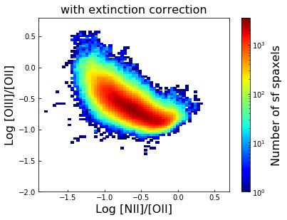

# Anomalously Low Metallicity & HⅠ gas

Because Github can not open and view large file, you can use this [website](https://nbviewer.jupyter.org/) to view jupyter notebook online (*or clone to the local device*):    

[NBviewer](https://nbviewer.jupyter.org/) 


## **`Summary `**   


We follow [Hwang et al. (2018)](https://arxiv.org/abs/1812.04614) to calculate the metallicity deviation, which is defined as . Because the distribution of metallicity deviation is a kind of **skew normal distribution**, we think some parts of spaxels are anomalously low. Then we define the criteria of ALM is , and we can find that the ALM/sf fraction and HI gas mass have a correlation coefficient 0.4. Therefore, it seems that there exist some relation between HI gas accretion and metallicity. However, we follow [Zu (2018)](https://arxiv.org/abs/1808.10501) to get the HI excess, we do not find good relation between HI excess and ALM/sf fraction. In order to explain the existence of ALM spaxels of galaxy, as mentioned in above figure, we think perhaps ALM is the proof of the difference between stars and spiral arms, which is consistent with **density wave theory**.

## Anomalously Low Metallicity (ALM)

### Data processing

Firstly, we need to select data and get rid of some bad data from MaNGA.  Use BPT diagram to select the star forming region. 

Galaxies distribution of MaNGA


### Metallicity (metal abundance)

Secondly, we need to calculate observed metallicity of each spaxel using Mappings and pyqz. Then use skew normal distribution to fit each bin and interpolate the data, so that we can get the expected metallicity. At last, we get the anomalously low metallicity (ALM) spaxel and ALM galaxy.

| We use O3N2 estimator of metallicity, the following is all of the spaxels from star-forming galaxies of MaNGA. | Use interpolation and extrapolation of HⅡ grid, we get the observed metallicity of each pixel. | This is a pretty beautiful picture (distinction correct and then undo it). |
| ------------------------------------------------------------ | ------------------------------------------------------------ | ------------------------------------------------------------ |
|  |  |  |

| Here, we interpolate each spaxel to get its expected metallcity. | Distribution of metallicity deviation. The criteria of ALM spaxel. |
| ------------------------------------------------------------ | ------------------------------------------------------------ |
|  |  |

This is a example galaxy showing the spatial distribution of metallicity deviation. It is consistent with [Hwang et al. (2018)](https://arxiv.org/abs/1812.04614)


## HI gas

Thirdly, we want to connect the ALM and HI. 

### ALM/sf vs. HI mass

For MaNGA, MaNGA-HI and MaNGA&ALFALFA, ALM galaxies proportion of star forming galaxies. This indicates that ALM galaxy is a kind of common phenomenon.


ALM/sf spaxles vs. HI mass of ALFALFA and HI-MaNGA with Poisson error.


Complete error of ALM/sf vs. HI mass in ALFALFA matching MaNGA.


Divide data with different stellar mass bin, and use several colors. Unfortunately, it seems no good relation.


Use Monte Carlo method to get the error of correlation coefficient.


### HI excess

According to the fitting formula from [Zu (2018)](https://arxiv.org/abs/1808.10501), we get the expected HI gas.


ALM/sf vs. HI excess

|                          Error bar                           |                   Correlation coefficient                    |
| :----------------------------------------------------------: | :----------------------------------------------------------: |
|  |  |

## Description

### ~~read_data_metallicity_mass_density.ipynb~~

>`This code is primary, low efficiency, almost useless.`
>
>calculate metallicity
>calculate mask using Marvin
>select galaxies which are late-type, non-inclined and star-forming
>
>* late-type: fracDeV<0.7
>* non-inclined: b/a>=0.3
>* star forming spaxels>=20 per galaxy
>
>distribution of metallicity in different global mass bin
>
>export data to TXT format file
>export data to CSV format file
>read data from a CSV format file

### ~~ALFALFA_MaNGA_match.ipynb~~

Due to some incidents of the server, this file is broken, so it is **useless** any more.

### down_marvin_fits.sh

>This shell script is used to download the fits file that Marvin tools need when you cannot run Marvin remotely, due to Marvin python package has two modes, local and remote. If you can use Marvin python package remotely, you **do not** need to download these files.
>
>Before running this script, you need to change the value of these variables: plate_file, ifu_file and num_galaxy
>
>* plate_file: Path of the plate file *[array, size=[4675,1]]*
>* ifu_file: Path of the ifu file *[array, size=[4675,1]]*
>* num_galaxy: Total number of the galaxies which need to be downloaded
>* by the way, if you wanna change  VOR10 to HYB10, you need to change the URL
>
>use command such as 
>
>```
>chmod +x down_marvin_fits.sh&&./down_marvin_fits.sh 2>error_down.log
>```
>
>after downloading the files, confirm whether they are complete
>
>```
>ls *gz  |  wc
>```
>
>you can also read the log file to look for which one missed
>
>PS. data of HYB10 is not complete, such as [8481-6103](https://lore.sdss.utah.edu/marvin/galaxy/8481-6103/)

### new_expected_Metallicity.ipynb

> Use interpolation and extrapolation to get the expected metallicity of each spaxel.

### `ALM_multiprocessing.ipynb`

> This is the **complete** code of ALM calculation following [Hwang et al. (2018)](https://arxiv.org/abs/1812.04614). Because of the multiprocessing, it is much faster.
>
> 1. read data
> 2. select galaxy, intrinsic extinction correction etc.
> 3. calculate observed and expected metallicity 
> 4. ALM criteria 
> 5. ALM region of each galaxy (image)
> 6. MaNGA & ALFALFA, ssfr vs. metallicity deviation, 
> 7. error of correlation coefficient (incomplete)

### /ALM.2.0/ALMsf_HI_errorbar.ipynb

> Calculate the error of correlation coefficient of ALM/sf and HI mass
>
> 1. calculate the error of HI mass in HI-MaNGA
> 2. use Monte Carlo method to calculate the error of correlation coefficient (ALFALFA&MaNGA or HI-MaNGA)

### /ALM.2.0/HI_excess.ipynb

> Calculate HI excess following [Zu (2018)](https://arxiv.org/abs/1808.10501)
>
> 1. read g-r from [NYU-vagc](http://sdss.physics.nyu.edu/vagc/), stellar mass from [NASA-Sloan Atlas (NSA)](https://www.sdss.org/dr13/manga/manga-target-selection/nsa/)
> 2. calculate HI excess 


* * *

---

## References

> + [SDSS website](https://www.sdss.org/)  [SDSS data](https://dr15.sdss.org/sas/) 
> + [MaNGA website](https://www.sdss.org/surveys/manga/)  [MaNGA Firefly datamodel](https://data.sdss.org/datamodel/files/MANGA_FIREFLY/FIREFLY_VER/manga_firefly.html)   [manga-firefly-v2_4_3-STELLARPOP.fits ](https://www.sdss.org/dr15/manga/manga-data/manga-firefly-value-added-catalog/)
> + [HI-MaNGA intro](https://www.sdss.org/dr15/data_access/value-added-catalogs/?vac_id=hi-manga-data-release-1)  [HI-MaNGA datamodel](https://data.sdss.org/datamodel/files/MANGA_HI/HIPVER/mangaHIall.html)  [mangaHIall.fits](https://dr15.sdss.org/sas/dr15/manga/HI/v1_0_1/mangaHIall.fits) 
> + [Marvin website](https://lore.sdss.utah.edu/marvin/)  [Marvin docs: Mass-Metallicity Relation](https://sdss-marvin.readthedocs.io/en/stable/tutorials/exercises/resolved_mass_metallicity_relation_SOLUTION.html)
> + [NASA-Sloan Atlas (NSA)](https://www.sdss.org/dr13/manga/manga-target-selection/nsa/)  [NSA datamodel](https://data.sdss.org/datamodel/files/ATLAS_DATA/ATLAS_MAJOR_VERSION/nsa.html) 
> + [Nair 2010 Visual Morphology of Galaxies](http://www.bo.astro.it/~nair/Morphology/Visual_Morphology.html) [NYU-vagc](http://sdss.physics.nyu.edu/vagc/)  [MPA-JHU](https://home.strw.leidenuniv.nl/~jarle/SDSS/)  [ALFALFA](http://egg.astro.cornell.edu/alfalfa/data/index.php) [Mappings](https://miocene.anu.edu.au/mappings/) [pyqz](http://fpavogt.github.io/pyqz/index.html) 
